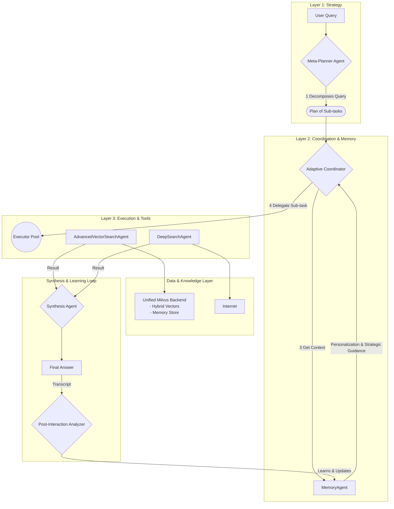

## HyDRA: Hybrid Dynamic RAG Agents

**An advanced, agentic AI framework that transforms Retrieval-Augmented Generation from a static pipeline into a dynamic, learning reasoning system.**

<p align="center">
  <a href="https://github.com/hassenhamdi/hydra/stargazers">
    
  </a>
  <a href="https://github.com/hassenhamdi/hydra/blob/main/LICENSE">
    
  </a>
  <a href="https://www.python.org/downloads/release/python-3100/">
    
  </a>
  <a href="https://milvus.io/">
    
  </a>
</p>

---

## Table of Contents

- [Announcements](#-announcements)
- [Why HyDRA?](#why-hydra)
- [Core Features](#-core-features)
- [Architectural Overview](#architectural-overview)
- [Technical Overview](#-technical-overview)
- [Project Structure](#-project-structure)
- [DuckDuckGo Integration](#-duckduckgo-integration)
- [Installation & Setup](#-installation--setup)
- [Usage](#-usage)
- [Future Roadmap](#-future-roadmap)
- [Star History](#-star-history)
- [Contributing](#-contributing)
- [Acknowledgements & Foundational Work](#-acknowledgements--foundational-work)
- [Citation](#-citation)
- [License](#license)

---

## 📢 Announcements

*   **2025-07-07**: Initial public release of HyDRA! Featuring a three-layer agentic architecture and a state-of-the-art, three-stage retrieval pipeline.

> [!NOTE]
> ⚠️ **Initial Release Notice:** This is the first public version of HyDRA. The code is provided as-is and is currently untested. Bugs are expected! We encourage the community to help us find them. Please feel free to **[open an issue](https://github.com/hassenhamdi/hydra/issues)** to report bugs, request features, or ask questions.

---

## Why HyDRA?

The world of Retrieval-Augmented Generation is evolving at a breakneck pace. Groundbreaking ideas are published monthly, but they often exist in isolation within academic papers or specific repositories. **HyDRA was born from a simple question: What would a system look like if we fused the best of these ideas into a single, cohesive, and practical framework?**

HyDRA is an ambitious attempt to synthesize and build upon the core principles of several leading-edge projects:

*   It adopts the robust, three-layer agentic structure from **HiRA** (Meta-Planner, Coordinator, Executors) to ensure a clean separation of strategy and execution.
*   It implements the multi-agent, multi-source retrieval philosophy of **HM-RAG**, enabling it to query different knowledge sources through specialized agents.
*   It leverages the **HyDE** technique within its vector search agent to bridge the semantic gap between user queries and stored documents.
*   It is powered by **Milvus**, used not just as a vector store but as a unified backend for hybrid search, RRF reranking, and agent memory.
*   It utilizes the full potential of the **BGE-M3** model for state-of-the-art dense and sparse embeddings.
*   The entire framework is built upon the flexible foundation provided by **LangChain**.

HyDRA is our answer to building a RAG system that is not just powerful, but also intelligent, adaptive, and architecturally sound.

### The HyDRA Metaphor

The name **HyDRA** is a direct metaphor for our agentic architecture: a single, powerful entity with multiple, specialized heads working in concert. Each "head" is an `Executor Agent` with a unique power (Vector Search, Web Research), directed by a central `Meta-Planner` brain.

---

## ✨ Core Features

-   ✅ **Three-Layer Agentic Architecture:** A `Meta-Planner` for strategy, an `AdaptiveCoordinator` for delegation, and specialized `Executors` for task execution.
-   ✅ **State-of-the-Art Three-Stage Retrieval:** A pipeline that combines **Hybrid Search**, **Reciprocal Rank Fusion (RRF)**, and a final **BGE Reranker** stage for maximum precision.
-   ✅ **Autonomous Learning (HELP/SIMPSON):** A long-term strategic learning loop that analyzes past performance to optimize future agent delegation and planning.
-   ✅ **Adaptive Retrieval Strategies:** The `AdvancedVectorSearchAgent` can autonomously use techniques like **HyDE** for conceptual queries.
-   ✅ **Interactive TUI:** A rich, user-friendly Terminal User Interface for a seamless chat experience.
-   ✅ **Configurable Deployment Profiles:** Easily switch between `development`, `production_balanced`, `production_gpu_throughput`, and `hyperscale` profiles.

---

## Architectural Overview

HyDRA's workflow is a three-layer system designed for maximum modularity. The `Meta-Planner` creates a high-level plan, which the `AdaptiveCoordinator` executes step-by-step by delegating to the best `Executor`. The `PostInteractionAnalyzer` reviews completed sessions to update the `MemoryAgent`, creating a continuous learning loop.



---

## 🛠️ Technical Overview

*   **Hybrid Search:** Combines semantic **Vector Search** with keyword-based **Lexical Search**.
*   **Embeddings (BGE-M3):** Uses **dense vectors** for meaning and **sparse vectors** for keywords. Supports **FP16** model quantization for GPU acceleration.
*   **Reciprocal Rank Fusion (RRF):** Merges dense and sparse search results efficiently within Milvus.
*   **Reranking Model (BGE-Reranker):** A powerful cross-encoder model that re-ranks fused candidates for maximum contextual relevance.
*   **Vector Quantization:** Supports database-level quantization (`HNSW_SQ8`, `IVF_RABITQ`) for scalable, cost-effective production deployments.

### **Brief Explanation for 'HELP/SIMPSON'**

#### **Autonomous Learning (HELP/SIMPSON)**

The **HELP (Heuristic Experience-based Learning Policy)** system, nicknamed **SIMPSON**, is HyDRA's mechanism for long-term strategic learning. It enables the agent to autonomously improve its decision-making over time by learning from past performance.

It operates in a simple, four-stage loop that occurs *after* a user interaction is complete:

1.  **Observe:** The `PostInteractionAnalyzer` agent reviews the full transcript of the conversation, including the plan created by the `Meta-Planner` and the results from each `Executor`.
2.  **Learn & Critique:** It evaluates the efficiency and success of each step. It identifies which agent delegations led to quick, accurate results (a success) and which were inefficient or required corrective follow-up actions (a failure).
3.  **Memorize:** This critique is stored as structured "policy memory" in Milvus. Each memory entry links a type of sub-task to the performance of the agent chosen for it.
4.  **Adapt:** The next time the `AdaptiveCoordinator` faces a similar sub-task, it retrieves this policy memory. This "strategic guidance" helps it make a more intelligent, experience-based decision, allowing it to repeat successful strategies and avoid past mistakes.

In short, **HELP/SIMPSON** is what allows HyDRA to evolve from simply executing tasks to learning the *best way* to execute them, making the entire system smarter and more efficient with every query it solves.

## 🪿 DuckDuckGo Integration


From the outset, HyDRA was designed to use practical, privacy-focused tools. Our choice of DuckDuckGo for web search was a strategic decision to ensure a **zero-friction setup** (no API key required) and to respect user privacy. Serendipitously, we discovered during development that searching for 'Hydra' on DuckDuckGo can reveal a multi-headed duck logo—a delightful revelation-like indicator that HyDRA project is a right choice.

## 📂 Project Structure
```
hydra/
├── .env.example
├── README.md
├── requirements.txt
├── main.py
├── configs/
│   ├── deployment_profiles.yaml
│   └── agents.yaml
├── data_processing/
│   └── ingest.py
└── src/
    ├── __init__.py
    ├── agents/
    │   ├── __init__.py
    │   ├── meta_planner.py, adaptive_coordinator.py, ...
    │   └── executors/
    │       ├── __init__.py
    │       └── vector.py, deep_search.py
    ├── core/
    │   ├── __init__.py
    │   └── reasoning_loop.py
    ├── retrieval/
    │   ├── __init__.py
    │   └── engine.py
    ├── services/
    │   ├── __init__.py
    │   └── milvus_setup.py
    ├── tui/
    │   ├── __init__.py
    │   └── handler.py
    └── utils/
        ├── __init__.py
        └── config_loader.py
```

---

## 🚀 Installation & Setup

### Prerequisites
*   Python 3.10+
*   An active Milvus instance (Milvus Lite is used by default).
*   A Google Gemini API Key.

### 1. Clone & Install
```bash
git clone https://github.com/hassenhamdi/hydra.git
cd hydra-rag
pip install -r requirements.txt
```

### 2. Configure Environment
Create a `.env` file from the example and add your API key:
```bash
cp .env.example .env
# Now, edit .env and add your GEMINI_API_KEY
```

### 3. Setup Milvus Collections
Run the setup script with your desired initial profile. This only needs to be done once per profile.
```bash
python -m src.services.milvus_setup --profile development
```

### 4. Ingest Your Data
Place your documents (e.g., `.txt`, `.md`) in a `data/` directory and run the ingestion script.
```bash
mkdir -p data
# Add your files to the data/ directory...

python -m data_processing.ingest --path ./data --profile development
```

---

## 💻 Usage

Launch the interactive TUI chat application. You can specify a user ID and performance profile.

```bash
python main.py --profile production_balanced --user_id alex
```

Once inside the TUI, you can chat naturally or use slash commands like `/help` for more control.

---

## 📝 Future Roadmap

-   [ ] **Comprehensive Testing & Benchmarking:** Rigorously evaluate HyDRA's performance on standard RAG benchmarks (e.g., GAIA, HotpotQA) to quantify its accuracy and efficiency.
-   [ ] **Full Multimodal Support:** Integrate vision and audio tools into dedicated `Executor` agents.

---

## ⭐ Star History

[](https://star-history.com/#hassen/hydra&Date)

---

## 🤝 Contributing

We welcome contributions from the community! Whether it's reporting a bug, suggesting a new feature, or submitting a pull request, your help is appreciated. Please see our (forthcoming) `CONTRIBUTING.md` for more details.

---

## 🤲 Acknowledgements & Foundational Work

- First and foremost I praise and thank Allah.
- My family.

- HyDRA architecture is a synthesis and extension of several groundbreaking concepts from the AI research community. We gratefully acknowledge the foundational work of the following papers and projects:

*   **HiRA:** For the three-layer hierarchical reasoning architecture. ([Paper](https://arxiv.org/abs/2507.02652) | [Repo](https://github.com/ignorejjj/hira))
*   **HM-RAG:** For the multi-agent, multi-source retrieval paradigm. ([Paper](https://arxiv.org/abs/2504.12330) | [Repo](https://github.com/ocean-luna/HMRAG))
*   **HyDE:** For the hypothetical document embedding retrieval strategy. ([Paper](https://arxiv.org/abs/2212.10496) | [Repo](https://github.com/texttron/hyde))
*   **BGE-M3 & Milvus:** For the core embedding and vector database technologies that power our hybrid search.

---

## 📄 Citation

If you use HyDRA in your work, please cite our project:

```bibtex
@software{hydra_agent_2025,
  author       = {Hassen Hamdi},
  title        = {HyDRA: Hybrid Dynamic RAG Agent},
  month        = {July},
  year         = {2025},
  publisher    = {GitHub},
  version      = {0.1.0},
  url          = {https://github.com/hassenhamdi/hydra}
}
```

---

## License
This project is licensed under the MIT License.
